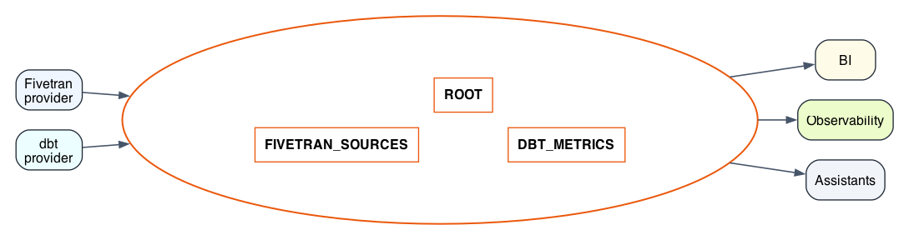

# Agents Schema

**A standard for communicating metadata to agents in a lakehouse.**

The Agents Schema is to lakehouses what `AGENTS.md` is to code repositories: a well-known location where tools, agents, and humans can discover what data exists, who owns it, and how to use it responsibly.



---

## Motivation

Agents operating over a lakehouse need context that isn't captured in table schemas alone: what a table is for, who maintains it, what transformations produced it, what it costs to query, and how it relates to other tables. Today this information lives in wikis, Slack threads, and tribal knowledge. The Agents Schema puts it in the warehouse itself, where agents can find it without leaving the query interface.

---

## What This Is For

The Agents Schema is primarily a discovery and orientation layer for agents working from inside a lakehouse or warehouse query surface.

Its main use cases are:
- helping agents discover what data exists, who owns it, and how it should be interpreted
- surfacing operational and semantic context close to the data itself
- providing a standard in-warehouse place for metadata from multiple systems to coexist
- enabling portable agent and tool behavior across warehouses without bespoke integrations for every provider

In practice, this means an agent should be able to connect to a warehouse, inspect the `AGENTS` schema, and quickly answer questions like:
- what curated tables exist versus raw ingested tables?
- which system populated this schema?
- what dbt model or semantic object represents this dataset?
- is this source stale or unhealthy?
- who owns this data product?

Well-known extensions are also a mechanism for tools to discover specific metadata they care about. For example:
- a BI tool could look specifically for dbt semantic-layer tables such as `AGENTS.DBT_SEMANTIC_MODEL`, `AGENTS.DBT_METRIC`, or related tables
- an observability tool could look for freshness or lineage metadata from a specific provider
- a generic agent runtime could use `AGENTS.ROOT` to discover which providers are present before deciding what else to query

The point is interoperability at the warehouse boundary: enough standardization that generic agents and downstream tools can discover useful context without direct access to every upstream system.

An important property of the Agents Schema is that it is self-documenting. The schema is meant to describe itself from inside the warehouse:
- `AGENTS.ROOT` tells a reader which providers are present
- the descriptions in `AGENTS.ROOT` explain what provider-contributed tables exist and how to interpret them
- a consumer can discover useful metadata by querying the warehouse alone, without prior vendor-specific assumptions

Well-known extensions are an optimization on top of that default discovery flow, not a replacement for it. A tool may choose to look directly for a stable, well-known table shape such as a dbt semantic-layer extension, but it does not have to. The baseline contract is still that the schema can be explored and understood through `AGENTS.ROOT`.

---

## What This Is Not For

The Agents Schema is not intended to replace specialized systems, source-native metadata APIs, or development-time tooling.

In particular, it is not:
- a full replacement for dbt artifacts, dbt Cloud APIs, or repository-native metadata parsing
- a substitute for source-control-aware tooling that operates on project files
- the canonical execution interface for vendor-specific platforms
- a complete semantic layer, catalog, or observability product by itself
- a requirement that every tool consume metadata from the warehouse instead of from primary sources

Specialized tools should still build their own context when they need deeper, fresher, or source-native representations.

For example:
- a dbt MCP server meant to help coding agents work on a dbt repository should build its context from the repository itself: model SQL files, YAML properties files, macros, `dbt_project.yml`, and dbt artifacts
- that server should not treat the `AGENTS` schema as its primary source of truth for authoring, refactoring, or validating dbt code
- similarly, a catalog, lineage engine, or observability platform may ingest the Agents Schema, but will often maintain a richer internal model built from APIs, repository scans, logs, or event streams

The Agents Schema is therefore best understood as:
- a shared, queryable metadata surface inside the lakehouse
- a lowest-common-denominator interoperability layer
- a convenient place for agents and tools to discover context when working from the data plane

It is not:
- the only metadata surface in the ecosystem
- the deepest possible representation of any provider's semantics
- a reason to stop building specialized tools with source-native context models

---

## Design Boundary

The boundary is:
- if the consumer starts from the warehouse and needs context about data that already exists there, the Agents Schema is a good fit
- if the consumer starts from a source system or codebase and needs full-fidelity authoring or operational context, it should usually use that system's native artifacts and APIs directly

This is especially important for coding and development workflows. A tool helping an agent edit a dbt repository should use dbt's source files and artifacts directly. A tool helping an agent understand a warehouse it can query should be able to benefit from the Agents Schema.

---

## Core: The `AGENTS` Schema

All Agents Schema tables live in a schema named `AGENTS`. The schema name is fixed as `AGENTS`. This schema must be created by whoever administers the lakehouse. Write access should be limited to providers, read access should be granted as broadly as possible. Providers should not place highly sensitive information in the AGENTS schema.

---

## `AGENTS.ROOT`

The single entry point for all metadata. Every provider that contributes metadata registers itself here.

`AGENTS.ROOT` is what makes the Agents Schema self-documenting. A generic consumer should be able to start here, learn which providers have published metadata, and read descriptions of the tables and conventions those providers expose.

```sql
CREATE TABLE AGENTS.ROOT (
  provider    VARCHAR NOT NULL,  -- namespace, e.g. 'fivetran', 'dbt', 'acme_corp'
  key         VARCHAR NOT NULL,  -- provider-defined section identifier
  description TEXT    NOT NULL,  -- markdown text describing this entry
  PRIMARY KEY (provider, key)
);
```

### Columns

| Column | Description |
|---|---|
| `provider` | A short, lowercase identifier for the metadata contributor. Typically a vendor name (`fivetran`, `dbt`) or an internal team name (`acme_data_platform`). Must match the prefix used in any `AGENTS.{PROVIDER}_*` tables contributed by this provider. |
| `key` | An arbitrary string chosen by the provider to organize their description into sections. Examples: `overview`, `connectors`, `lineage`, `costs`. Unique within a provider. |
| `description` | A markdown blob. May describe the provider, explain an extension table, document conventions, or provide any context useful to an agent or human reader. Taken together, these rows document the rest of the schema. |

### Example rows

```
provider   key        description
---------  ---------  ------------------------------------------------
fivetran   overview   # Fivetran\nFivetran syncs data from SaaS sources...
fivetran   schema     See AGENTS.FIVETRAN_CONNECTOR and AGENTS.FIVETRAN_TABLE...
dbt        overview   # dbt\nTransformation layer. See AGENTS.DBT_MODEL...
dbt        lineage    Column-level lineage available in AGENTS.DBT_COLUMN_LINEAGE...
acme_corp  costs      # Query Costs\nSee AGENTS.ACME_CORP_TABLE_COSTS...
```

---

## Provider-Contributed Tables

Providers may contribute additional tables to the `AGENTS` schema. To prevent name conflicts, all such tables must follow this naming convention:

```
AGENTS.{PROVIDER}_{TABLE_NAME}
```

The `PROVIDER` prefix must exactly match the `provider` value used in `AGENTS.ROOT`. Providers should document each contributed table in `AGENTS.ROOT` with an appropriate `key`.

**Example:** If `provider = 'acme_corp'`, contributed tables must be named `AGENTS.ACME_CORP_*`.

---

## Well-Known Extensions

Well-known extensions are provider-contributed tables from specific vendors that tools may query directly — without reading `AGENTS.ROOT` first — because their schema is part of this specification. Providers should still register them in `AGENTS.ROOT`, but the schemas here are stable and publicly documented.

This means there are two valid discovery paths:
- generic discovery: start at `AGENTS.ROOT`, read provider descriptions, then inspect the referenced tables
- shortcut discovery: if a tool already knows a well-known extension, it may query those tables directly

The first path is the default and is what makes the Agents Schema self-describing. The second path exists for convenience and interoperability with tools that want to consume a stable schema without first reading provider-written descriptions.

---

## Extension: `fivetran`

The Fivetran extension surfaces metadata from the [Fivetran Platform Connector](https://fivetran.com/docs/logs/fivetran-platform): the connectors ingesting data, the destinations they write to, the structural schema of synced data, and recent sync health.

Agents can use this extension to understand where raw data came from, when it was last updated, and whether any connectors are in a degraded state.

### `AGENTS.FIVETRAN_CONNECTOR`

One row per Fivetran connector (called a "connection" in the Fivetran UI).

```sql
CREATE TABLE AGENTS.FIVETRAN_CONNECTOR (
  connector_id     VARCHAR NOT NULL PRIMARY KEY,
  connector_name   VARCHAR NOT NULL,
  connector_type   VARCHAR NOT NULL,  -- e.g. 'postgres', 'salesforce', 'stripe'
  destination_id   VARCHAR NOT NULL,
  destination_name VARCHAR NOT NULL,
  destination_schema VARCHAR NOT NULL, -- the schema written to in the warehouse
  status           VARCHAR NOT NULL,  -- 'ACTIVE', 'BROKEN', 'PAUSED', 'DELETED'
  sync_frequency   INTEGER,           -- minutes between syncs, NULL if unscheduled
  last_synced_at   TIMESTAMP,
  created_at       TIMESTAMP NOT NULL,
  description      TEXT               -- optional human-written notes
);
```

| Column | Description |
|---|---|
| `connector_id` | Stable Fivetran-assigned identifier. |
| `connector_type` | The source application type. Use this to understand the origin system. |
| `destination_schema` | The schema in the warehouse where this connector writes its tables. Join to `AGENTS.FIVETRAN_TABLE.schema_name` to enumerate tables. |
| `status` | `BROKEN` or `PAUSED` connectors may mean stale data downstream. |
| `last_synced_at` | When the most recent successful sync completed. |

### `AGENTS.FIVETRAN_TABLE`

One row per synced table, across all connectors.

```sql
CREATE TABLE AGENTS.FIVETRAN_TABLE (
  connector_id  VARCHAR NOT NULL,
  schema_name   VARCHAR NOT NULL,  -- warehouse schema (matches destination_schema)
  table_name    VARCHAR NOT NULL,
  enabled       BOOLEAN NOT NULL,  -- whether this table is included in syncs
  row_count     BIGINT,            -- approximate, as of last sync
  last_synced_at TIMESTAMP,
  PRIMARY KEY (connector_id, schema_name, table_name)
);
```

### `AGENTS.FIVETRAN_COLUMN`

One row per synced column.

```sql
CREATE TABLE AGENTS.FIVETRAN_COLUMN (
  connector_id    VARCHAR NOT NULL,
  schema_name     VARCHAR NOT NULL,
  table_name      VARCHAR NOT NULL,
  column_name     VARCHAR NOT NULL,
  data_type       VARCHAR,
  is_primary_key  BOOLEAN NOT NULL DEFAULT FALSE,
  enabled         BOOLEAN NOT NULL,
  PRIMARY KEY (connector_id, schema_name, table_name, column_name)
);
```

### `AGENTS.FIVETRAN_SYNC_LOG`

Recent sync events — errors, warnings, and completions — for connector health monitoring. Agents should query this to understand whether data freshness issues are due to connector failures.

```sql
CREATE TABLE AGENTS.FIVETRAN_SYNC_LOG (
  log_id        VARCHAR NOT NULL PRIMARY KEY,
  connector_id  VARCHAR NOT NULL,
  sync_id       VARCHAR,
  occurred_at   TIMESTAMP NOT NULL,
  event_type    VARCHAR NOT NULL,    -- 'INFO', 'WARNING', 'ERROR', 'SEVERE'
  message       TEXT NOT NULL,
  message_data  VARIANT              -- structured JSON payload for ERROR/SEVERE events
);
```

| Column | Description |
|---|---|
| `event_type` | `WARNING` and `ERROR` entries indicate transient issues; `SEVERE` typically means the connector is broken and requires intervention. |
| `message_data` | JSON blob with structured context. For schema change events, contains `schema_name` and `table_name`. |

Suggested query for agents checking data freshness:

```sql
SELECT connector_name, status, last_synced_at,
       DATEDIFF('hour', last_synced_at, CURRENT_TIMESTAMP) AS hours_since_sync
FROM AGENTS.FIVETRAN_CONNECTOR
WHERE status != 'PAUSED'
ORDER BY hours_since_sync DESC NULLS FIRST;
```

---

## Extension: `dbt`

The dbt extension provides a normalized, queryable representation of the information in dbt's `manifest.json`. It captures the transformation layer: what models exist, how they are documented, how they depend on each other, and what tests are defined.

Agents can use this extension to understand what "curated" tables exist (as opposed to raw ingested data), trace column lineage, find model owners, and assess test coverage.

For teams using dbt's Semantic Layer, this extension can also be extended with metadata normalized from `semantic_manifest.json`. That artifact captures semantic models, entities, dimensions, measures, metrics, and saved queries defined on top of dbt models.

### `AGENTS.DBT_MODEL`

One row per dbt model. Corresponds to `nodes` entries in `manifest.json` where `resource_type = 'model'`.

```sql
CREATE TABLE AGENTS.DBT_MODEL (
  unique_id        VARCHAR NOT NULL PRIMARY KEY, -- 'model.<package>.<name>'
  name             VARCHAR NOT NULL,
  package_name     VARCHAR NOT NULL,
  database_name    VARCHAR NOT NULL,  -- warehouse database
  schema_name      VARCHAR NOT NULL,  -- warehouse schema
  materialization  VARCHAR NOT NULL,  -- 'table', 'view', 'incremental', 'ephemeral'
  description      TEXT,              -- from schema.yml
  owner            VARCHAR,           -- from meta.owner or config.meta.owner
  tags             ARRAY,             -- list of string tags
  file_path        VARCHAR NOT NULL,  -- relative path to .sql file
  access           VARCHAR,           -- 'public', 'protected', 'private' (dbt 1.7+)
  contract_enforced BOOLEAN DEFAULT FALSE,
  created_at       TIMESTAMP          -- manifest generation time
);
```

| Column | Description |
|---|---|
| `unique_id` | Globally unique. Use this to join to other dbt extension tables. |
| `materialization` | Ephemeral models have no warehouse object; agents should note this when suggesting queries. |
| `description` | Free-text documentation from `schema.yml`. Often the richest signal about what a model represents. |
| `owner` | Populated from `meta.owner` in `schema.yml`. Useful for routing questions about a model. |
| `access` | dbt's access modifier — `public` models are intended for broad use; `private` models are internal to their package. |

### `AGENTS.DBT_COLUMN`

One row per documented column on a model. Normalized from the `columns` map on each node in `manifest.json`.

```sql
CREATE TABLE AGENTS.DBT_COLUMN (
  model_unique_id  VARCHAR NOT NULL,  -- FK to AGENTS.DBT_MODEL.unique_id
  column_name      VARCHAR NOT NULL,
  data_type        VARCHAR,           -- declared type, may differ from warehouse DDL
  description      TEXT,
  tags             ARRAY,
  meta             VARIANT,           -- arbitrary key-value pairs from schema.yml
  PRIMARY KEY (model_unique_id, column_name)
);
```

### `AGENTS.DBT_SOURCE`

One row per dbt source table. Corresponds to `sources` entries in `manifest.json`.

```sql
CREATE TABLE AGENTS.DBT_SOURCE (
  unique_id      VARCHAR NOT NULL PRIMARY KEY, -- 'source.<package>.<source>.<table>'
  source_name    VARCHAR NOT NULL,             -- the source block name in schema.yml
  table_name     VARCHAR NOT NULL,             -- the individual table within the source
  database_name  VARCHAR NOT NULL,
  schema_name    VARCHAR NOT NULL,
  description    TEXT,
  loader         VARCHAR,                      -- e.g. 'fivetran', 'airbyte', 'stitch'
  freshness_warn_after_hours  INTEGER,
  freshness_error_after_hours INTEGER
);
```

| Column | Description |
|---|---|
| `loader` | Declared in `schema.yml`. When `loader = 'fivetran'`, join to `AGENTS.FIVETRAN_CONNECTOR` on `schema_name` to get sync health. |
| `freshness_*` | Thresholds from dbt source freshness configuration. |

### `AGENTS.DBT_DEPENDENCY`

The lineage graph: one row per directed edge in the DAG. Normalized from `parent_map` and `child_map` in `manifest.json`.

```sql
CREATE TABLE AGENTS.DBT_DEPENDENCY (
  upstream_id    VARCHAR NOT NULL,  -- unique_id of the upstream node
  downstream_id  VARCHAR NOT NULL,  -- unique_id of the downstream node
  upstream_type  VARCHAR NOT NULL,  -- 'model', 'source', 'seed', 'snapshot'
  downstream_type VARCHAR NOT NULL,
  PRIMARY KEY (upstream_id, downstream_id)
);
```

To find all models that depend (directly or indirectly) on a source, agents can walk this table recursively using a CTE. Example:

```sql
WITH RECURSIVE lineage AS (
  SELECT downstream_id AS node_id FROM AGENTS.DBT_DEPENDENCY
  WHERE upstream_id = 'source.my_project.fivetran_salesforce.account'
  UNION ALL
  SELECT d.downstream_id FROM AGENTS.DBT_DEPENDENCY d
  JOIN lineage l ON d.upstream_id = l.node_id
)
SELECT DISTINCT m.name, m.schema_name, m.description
FROM lineage JOIN AGENTS.DBT_MODEL m ON m.unique_id = lineage.node_id;
```

### `AGENTS.DBT_TEST`

One row per dbt test. Corresponds to `nodes` where `resource_type = 'test'`.

```sql
CREATE TABLE AGENTS.DBT_TEST (
  unique_id        VARCHAR NOT NULL PRIMARY KEY,
  test_name        VARCHAR NOT NULL,   -- e.g. 'not_null', 'unique', 'accepted_values'
  attached_to_id   VARCHAR NOT NULL,   -- unique_id of model or source being tested
  column_name      VARCHAR,            -- NULL for model-level tests
  severity         VARCHAR NOT NULL,   -- 'warn' or 'error'
  test_type        VARCHAR NOT NULL    -- 'generic' or 'singular'
);
```

### `AGENTS.DBT_EXPOSURE`

One row per dbt exposure: downstream consumers of dbt models such as dashboards, ML models, or applications.

```sql
CREATE TABLE AGENTS.DBT_EXPOSURE (
  unique_id    VARCHAR NOT NULL PRIMARY KEY,
  name         VARCHAR NOT NULL,
  type         VARCHAR NOT NULL,   -- 'dashboard', 'ml', 'application', 'analysis', 'notebook'
  description  TEXT,
  owner_name   VARCHAR,
  owner_email  VARCHAR,
  url          VARCHAR,
  tags         ARRAY
);
```

```sql
-- Which exposures depend on a given model?
SELECT e.name, e.type, e.owner_email, e.url
FROM AGENTS.DBT_EXPOSURE e
JOIN AGENTS.DBT_DEPENDENCY d ON d.downstream_id = e.unique_id
WHERE d.upstream_id = 'model.my_project.fct_orders';
```

### Semantic Layer Sketch

dbt's Semantic Layer sits one level above the core DAG metadata above. A practical representation in the Agents Schema is:
- keep `AGENTS.DBT_MODEL` as the physical/modeling layer
- add semantic-layer tables sourced from `semantic_manifest.json`
- link each semantic model back to exactly one dbt model
- normalize reusable semantic primitives separately from queryable metrics

That yields a shape like this:

### `AGENTS.DBT_SEMANTIC_MODEL`

One row per semantic model. Corresponds to semantic model definitions in `semantic_manifest.json`.

```sql
CREATE TABLE AGENTS.DBT_SEMANTIC_MODEL (
  unique_id             VARCHAR NOT NULL PRIMARY KEY, -- 'semantic_model.<package>.<name>'
  name                  VARCHAR NOT NULL,
  package_name          VARCHAR NOT NULL,
  model_unique_id       VARCHAR NOT NULL,            -- FK to AGENTS.DBT_MODEL.unique_id
  node_relation_name    VARCHAR,                     -- rendered warehouse relation, if available
  description           TEXT,
  default_time_dimension VARCHAR,
  primary_entity_name   VARCHAR,
  label                 VARCHAR,
  config                VARIANT,                     -- semantic-model-specific config
  created_at            TIMESTAMP
);
```

This is the anchor table for the semantic graph. If an agent needs to answer "what business object is this metric defined on?", it should start here and then traverse dimensions, entities, and measures.

### `AGENTS.DBT_SEMANTIC_ENTITY`

One row per entity on a semantic model. Entities are the join keys that connect semantic models.

```sql
CREATE TABLE AGENTS.DBT_SEMANTIC_ENTITY (
  semantic_model_unique_id VARCHAR NOT NULL,
  entity_name              VARCHAR NOT NULL,
  entity_type              VARCHAR NOT NULL, -- 'primary', 'unique', 'foreign', 'natural'
  expr                     VARCHAR,          -- source expression if name differs from column
  role                     VARCHAR,          -- optional semantic role if dbt surfaces one
  description              TEXT,
  PRIMARY KEY (semantic_model_unique_id, entity_name)
);
```

This table is the semantic analogue of `AGENTS.DBT_DEPENDENCY`: instead of DAG edges, it describes the join surface MetricFlow can use at query time.

### `AGENTS.DBT_SEMANTIC_DIMENSION`

One row per dimension exposed by a semantic model.

```sql
CREATE TABLE AGENTS.DBT_SEMANTIC_DIMENSION (
  semantic_model_unique_id VARCHAR NOT NULL,
  dimension_name           VARCHAR NOT NULL,
  dimension_type           VARCHAR NOT NULL, -- 'categorical', 'time'
  expr                     VARCHAR,
  data_type                VARCHAR,
  description              TEXT,
  label                    VARCHAR,
  type_params              VARIANT,          -- time granularity / validity params / etc.
  is_partition             BOOLEAN,
  PRIMARY KEY (semantic_model_unique_id, dimension_name)
);
```

Time dimensions belong here, including the semantic model's default aggregation time dimension.

### `AGENTS.DBT_SEMANTIC_MEASURE`

One row per measure on a semantic model. Measures are the raw aggregations from which many metrics are built.

```sql
CREATE TABLE AGENTS.DBT_SEMANTIC_MEASURE (
  semantic_model_unique_id   VARCHAR NOT NULL,
  measure_name               VARCHAR NOT NULL,
  agg                        VARCHAR NOT NULL, -- 'sum', 'count', 'count_distinct', 'avg', ...
  expr                       VARCHAR,
  data_type                  VARCHAR,
  description                TEXT,
  label                      VARCHAR,
  agg_time_dimension         VARCHAR,
  non_additive_dimension_name VARCHAR,
  create_metric              BOOLEAN,
  config                     VARIANT,
  PRIMARY KEY (semantic_model_unique_id, measure_name)
);
```

This lets agents distinguish between:
- base semantic measures, which are directly aggregatable
- user-facing metrics, which may wrap one or more measures with additional logic

### `AGENTS.DBT_METRIC`

One row per metric exposed by the Semantic Layer.

```sql
CREATE TABLE AGENTS.DBT_METRIC (
  unique_id       VARCHAR NOT NULL PRIMARY KEY, -- 'metric.<package>.<name>'
  name            VARCHAR NOT NULL,
  package_name    VARCHAR NOT NULL,
  metric_type     VARCHAR NOT NULL,             -- e.g. 'simple', 'ratio', 'derived', 'cumulative'
  label           VARCHAR,
  description     TEXT,
  type_params     VARIANT,                      -- metric-type-specific configuration
  filter_sql      TEXT,
  time_grains     ARRAY,                        -- supported grains if materialized in artifact
  dimensions      ARRAY,                        -- allowed dimensions if materialized in artifact
  created_at      TIMESTAMP
);
```

`type_params` is important here because dbt metric definitions vary by type. For example:
- a simple metric points at a measure
- a ratio metric has numerator/denominator inputs
- a derived metric references other metrics
- a cumulative metric carries windowing semantics

### `AGENTS.DBT_METRIC_INPUT`

One row per metric input, so agents can trace how a metric is assembled.

```sql
CREATE TABLE AGENTS.DBT_METRIC_INPUT (
  metric_unique_id         VARCHAR NOT NULL,
  input_order              INTEGER NOT NULL,
  input_kind               VARCHAR NOT NULL, -- 'measure', 'metric'
  semantic_model_unique_id VARCHAR,          -- set when input_kind = 'measure'
  measure_name             VARCHAR,          -- set when input_kind = 'measure'
  input_metric_unique_id   VARCHAR,          -- set when input_kind = 'metric'
  role                     VARCHAR,          -- 'numerator', 'denominator', 'operand', etc.
  params                   VARIANT,          -- alias/window/offset/filter per input
  PRIMARY KEY (metric_unique_id, input_order)
);
```

Without this table, an agent can list metrics but cannot explain them. With it, an agent can answer questions like "what does gross_margin depend on?" or "is revenue a direct sum or a derived metric?"

### `AGENTS.DBT_SAVED_QUERY`

One row per saved query. Saved queries package a set of metrics plus dimensions, filters, and grain into a reusable query definition.

```sql
CREATE TABLE AGENTS.DBT_SAVED_QUERY (
  unique_id        VARCHAR NOT NULL PRIMARY KEY, -- 'saved_query.<package>.<name>'
  name             VARCHAR NOT NULL,
  package_name     VARCHAR NOT NULL,
  description      TEXT,
  label            VARCHAR,
  query_params     VARIANT,                      -- exported grain, filters, limits, etc.
  created_at       TIMESTAMP
);
```

### `AGENTS.DBT_SAVED_QUERY_ITEM`

One row per metric or dimension selected by a saved query.

```sql
CREATE TABLE AGENTS.DBT_SAVED_QUERY_ITEM (
  saved_query_unique_id   VARCHAR NOT NULL,
  item_order              INTEGER NOT NULL,
  item_kind               VARCHAR NOT NULL, -- 'metric', 'dimension'
  metric_unique_id        VARCHAR,
  semantic_model_unique_id VARCHAR,
  dimension_name          VARCHAR,
  params                  VARIANT,
  PRIMARY KEY (saved_query_unique_id, item_order)
);
```

This keeps saved queries queryable without baking every semantic-layer concept into one opaque JSON blob.

### Why represent it this way?

This shape preserves the same design choices used elsewhere in the Agents Schema:
- one table per stable concept
- relational joins for the most common agent questions
- `VARIANT` only where dbt's schema is genuinely polymorphic

It also lets agents answer distinct classes of questions cleanly:
- physical layer: "what warehouse relation does this come from?" via `AGENTS.DBT_MODEL`
- semantic graph: "what can join to what?" via `AGENTS.DBT_SEMANTIC_ENTITY`
- query surface: "what dimensions/measures exist?" via `AGENTS.DBT_SEMANTIC_DIMENSION` and `AGENTS.DBT_SEMANTIC_MEASURE`
- governed business logic: "what is the canonical metric?" via `AGENTS.DBT_METRIC` and `AGENTS.DBT_METRIC_INPUT`
- reusable consumption patterns: "what metric bundles are already curated?" via `AGENTS.DBT_SAVED_QUERY*`

Example: trace a metric back to its underlying dbt model(s):

```sql
SELECT
  m.name AS metric_name,
  sm.name AS semantic_model_name,
  dm.schema_name,
  dm.name AS dbt_model_name,
  mi.role,
  mi.measure_name
FROM AGENTS.DBT_METRIC m
JOIN AGENTS.DBT_METRIC_INPUT mi
  ON mi.metric_unique_id = m.unique_id
JOIN AGENTS.DBT_SEMANTIC_MODEL sm
  ON sm.unique_id = mi.semantic_model_unique_id
JOIN AGENTS.DBT_MODEL dm
  ON dm.unique_id = sm.model_unique_id
WHERE m.unique_id = 'metric.analytics.revenue';
```

If you wanted to keep the first version smaller, the minimum viable addition would be just:
- `AGENTS.DBT_SEMANTIC_MODEL`
- `AGENTS.DBT_SEMANTIC_ENTITY`
- `AGENTS.DBT_SEMANTIC_DIMENSION`
- `AGENTS.DBT_SEMANTIC_MEASURE`
- `AGENTS.DBT_METRIC`
- `AGENTS.DBT_METRIC_INPUT`

That covers the core semantic graph and metric definitions; saved queries can be added later.

---

## Cross-Extension Queries

One of the most valuable things agents can do is join across extensions. Example: finding raw source tables that feed a specific dbt model, then checking whether those sources' Fivetran connectors are healthy.

```sql
-- Trace a dbt model back to its Fivetran connectors and check sync health
WITH RECURSIVE upstream AS (
  SELECT upstream_id AS node_id, upstream_type
  FROM AGENTS.DBT_DEPENDENCY
  WHERE downstream_id = 'model.analytics.fct_revenue'
  UNION ALL
  SELECT d.upstream_id, d.upstream_type
  FROM AGENTS.DBT_DEPENDENCY d
  JOIN upstream u ON d.downstream_id = u.node_id
)
SELECT
  s.source_name,
  s.schema_name,
  c.connector_name,
  c.connector_type,
  c.status,
  c.last_synced_at
FROM upstream u
JOIN AGENTS.DBT_SOURCE s      ON s.unique_id = u.node_id
JOIN AGENTS.FIVETRAN_CONNECTOR c ON c.destination_schema = s.schema_name
WHERE u.upstream_type = 'source';
```

---

## Conventions and Guidance for Implementors

### Populating the tables

Agents Schema tables are typically populated by:
- **Vendor-run pipelines** (e.g. the Fivetran Platform Connector syncing to `AGENTS.FIVETRAN_*`)
- **CI/CD jobs** (e.g. a dbt post-deploy step that parses `manifest.json` and loads `AGENTS.DBT_*`)
- **Platform engineering teams** maintaining custom provider tables

### Staleness

Each extension table should ideally carry a `_synced_at` timestamp in a companion `AGENTS.{PROVIDER}_SYNC_STATUS` table or as a column on the table itself. Agents should check this before drawing conclusions about current state.

### Permissions

- `AGENTS.ROOT` and all extension tables should be readable by any warehouse principal that runs analytical queries.
- Write access should be tightly controlled — only the owning system should insert or update rows.

### Reserved providers

The following provider names are reserved by this specification:

| Provider | Reserved for |
|---|---|
| `fivetran` | Fivetran Platform Connector extension (this spec) |
| `dbt` | dbt manifest extension (this spec) |
| `agents_schema` | Future use by the Agents Schema specification itself |

---

## Summary of All Tables

| Table | Provider | Purpose |
|---|---|---|
| `AGENTS.ROOT` | *(core)* | Registry of all metadata providers and sections |
| `AGENTS.FIVETRAN_CONNECTOR` | fivetran | One row per Fivetran connector |
| `AGENTS.FIVETRAN_TABLE` | fivetran | Synced tables with row counts and freshness |
| `AGENTS.FIVETRAN_COLUMN` | fivetran | Column-level schema for synced tables |
| `AGENTS.FIVETRAN_SYNC_LOG` | fivetran | Recent sync events, errors, and warnings |
| `AGENTS.DBT_MODEL` | dbt | dbt models with documentation, owner, materialization |
| `AGENTS.DBT_COLUMN` | dbt | Per-column documentation for dbt models |
| `AGENTS.DBT_SOURCE` | dbt | dbt source declarations with freshness thresholds |
| `AGENTS.DBT_DEPENDENCY` | dbt | DAG edges for upstream/downstream lineage |
| `AGENTS.DBT_TEST` | dbt | Test definitions and which columns they cover |
| `AGENTS.DBT_EXPOSURE` | dbt | Downstream consumers (dashboards, apps, ML models) |
| `AGENTS.DBT_SEMANTIC_MODEL` | dbt | Semantic models defined on top of dbt models |
| `AGENTS.DBT_SEMANTIC_ENTITY` | dbt | Joinable entities/keys for semantic models |
| `AGENTS.DBT_SEMANTIC_DIMENSION` | dbt | Queryable semantic dimensions |
| `AGENTS.DBT_SEMANTIC_MEASURE` | dbt | Base semantic measures and aggregation rules |
| `AGENTS.DBT_METRIC` | dbt | User-facing governed metrics |
| `AGENTS.DBT_METRIC_INPUT` | dbt | Metric composition and dependencies |
| `AGENTS.DBT_SAVED_QUERY` | dbt | Reusable saved metric queries |
| `AGENTS.DBT_SAVED_QUERY_ITEM` | dbt | Metrics/dimensions selected by saved queries |
