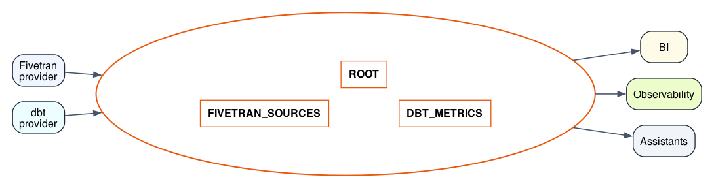

# Agents Schema

Agents need context to answer questions about warehouse data. Agents Schema puts
that context in the warehouse itself, in a standard `AGENTS` schema, so agents
can query metadata next to the data they are reasoning over. See
[Why Agents Schema](#why-agents-schema) for more on the idea behind it and
[SPEC.md](./SPEC.md) for the schema contract.

This repository provides GitHub workflows that ingest source metadata from
your repository and publish it into `AGENTS`.



Run one of the workflows below to populate the `AGENTS` schema from a source
you already have. Once it's populated, anything that already queries your
warehouse can read those tables as ordinary SQL, including Cursor, Claude
Code, notebooks, and internal agents. The fastest path is usually dbt: if your
repo already produces `target/manifest.json`, the workflow only needs the dbt
project path and your warehouse credentials.

After the first run, your warehouse has queryable metadata tables such as
`AGENTS.DBT_MODEL`, `AGENTS.LOOKML_VIEW`, `AGENTS.OMNI_VIEW`, or `AGENTS.OSI_DATASET`. Agents can
use those tables to understand which models and semantic objects exist, how
they are documented, how they relate to the warehouse, and what context is
available before writing or explaining queries.

## Contents

- [Getting Started](#getting-started)
  - [Prerequisites](#prerequisites)
- [Guides](#guides)
  - [Sync dbt](#sync-dbt)
  - [Sync Looker](#sync-looker)
  - [Sync Omni](#sync-omni)
  - [Sync OSI](#sync-osi)
  - [Sync Sigma](#sync-sigma)
  - [Sync Multiple Sources](#sync-multiple-sources)
- [Query with an agent](#query-with-an-agent)
  - [Install the Codex plugin](#install-the-codex-plugin)
  - [Install the Claude Code plugin](#install-the-claude-code-plugin)
- [Why Agents Schema](#why-agents-schema)
  - [How it works](#how-it-works)
- [Reference](#reference)
  - [CLI](#cli)
  - [Versioning](#versioning)
  - [Specification](#specification)

## Getting Started

Pick a metadata source and a destination warehouse to get started quickly.

Supported sources:

- dbt
- Looker
- Omni
- OSI
- Sigma
- Markdown skills

Supported destinations:

- Snowflake
- Databricks
- BigQuery
- ClickHouse ([destination notes](clickhouse-setup.md))

### Prerequisites

Each workflow writes to your warehouse using a single GitHub Actions secret:
`WAREHOUSE_CREDENTIALS`. Each source setup guide includes collapsible
destination-specific examples for Snowflake, Databricks, BigQuery, and
ClickHouse; [ClickHouse Setup](clickhouse-setup.md) has the ClickHouse
credential shape and destination-specific mapping notes.

## Guides

### Sync dbt

Use [dbt Setup Guide](dbt-setup.md) when your repository contains a dbt project
or an existing `target/manifest.json`.

### Sync Looker

Use [Looker Setup Guide](looker-setup.md) when your repository contains LookML
files.

### Sync Omni

Use [Omni Setup Guide](omni-setup.md) when your repository contains Omni YAML
files synced via the Omni Git integration.

### Sync OSI

Use [OSI Setup Guide](osi-setup.md) when your repository contains Open Semantic
Interchange `*.osi.yaml` files.

### Sync Sigma

Use [Sigma Setup Guide](sigma-setup.md) when your repository contains exported
Sigma data model `*.sigma.yaml` files.

### Sync Multiple Sources

Use the reusable workflows together when one repository contains multiple
metadata sources. See [examples/workflows/dbt-looker.yml](examples/workflows/dbt-looker.yml)
and [examples/workflows/dbt-looker-osi.yml](examples/workflows/dbt-looker-osi.yml).

## Query with an agent

This repository is also a plugin marketplace for Codex and Claude Code. Its `agents-schema`
plugin installs two independent skills before an agent connects to your warehouse:

- `connect-warehouse` configures and verifies Snowflake, BigQuery, Databricks, or ClickHouse access.
- `agents-schema-search` discovers warehouse metadata through `AGENTS.ROOT` after a connection
  is available.

These plugin skills are local agent tooling. They do not replace the existing destination-matched
`agents-schema-analyst` row that the ingestion CLI publishes into `AGENTS.ROOT`; that warehouse-side
behavior remains unchanged. Teams can also continue publishing their own warehouse-delivered
Markdown skills through the skills provider.

### Install the Codex plugin

Add this GitHub repository as a marketplace and install the plugin:

```bash
codex plugin marketplace add dbt-labs/agents_schema
codex plugin add agents-schema@agents-schema
```

Start a new Codex task after installation so the new skills are available. The marketplace lives
at `.agents/plugins/marketplace.json`, and additional Agents Schema plugins can be added under
`plugins/` over time.

### Install the Claude Code plugin

Add this GitHub repository as a marketplace and install the plugin:

```bash
claude plugin marketplace add dbt-labs/agents_schema
claude plugin install agents-schema@agents-schema
```

Start a new Claude Code session after installation, or run `/reload-plugins` in the current
session. Claude Code exposes the skills as `/agents-schema:connect-warehouse` and
`/agents-schema:agents-schema-search`; it can also invoke them automatically when relevant.
The Claude Code marketplace lives at `.claude-plugin/marketplace.json`. Both Claude Code and
Codex install the same skill definitions under `plugins/agents-schema/skills/`.

## Why Agents Schema

Agents operating over a warehouse need context that is not captured in table
schemas alone: what a table is for, who maintains it, what transformations
produced it, what it costs to query, and how it relates to other tables. Today
this information often lives in wikis, Slack threads, dashboards, and tribal
knowledge. Agents Schema puts it in the warehouse itself, where agents can find
it without leaving the query interface.

Agents Schema is a discovery layer for agents that already query your
warehouse. It gives them a standard place to ask: what curated tables exist,
which system published the metadata, what dbt model or LookML object backs a
dataset, what OSI semantic model describes it, whether a source is stale, and
who owns a data product.

The schema is self-documenting. `AGENTS.ROOT` tells consumers which providers
are present and explains what provider-contributed tables mean. Consumers can
start there for generic discovery, or query well-known extension tables directly
when they already know the shape they need.

Agents Schema assumes its consumer is an AI agent, not a deterministic
application that needs a fixed contract from providers. Because an agent can
interpret loosely structured content, provider data is free to be
semi-structured, denormalized, or concatenated into markdown, and free to
change shape as providers and models evolve, rather than conforming to a
rigid schema every provider and consumer must agree on in advance.

Agents Schema is not a replacement for specialized systems, source-native
metadata APIs, or development-time tooling. A dbt MCP server helping an agent
edit a dbt repository should still use dbt source files and artifacts directly.
Agents Schema is the shared, queryable metadata surface for consumers that start
from the warehouse and need context about data that already exists there.

It is closest in spirit to `information_schema`, but extensible across many
providers. Compared with MCP servers, Agents Schema is narrower: it publishes
context inside the warehouse, while MCP servers can expose tools, actions, and
source-specific workflows.

### How it works

1. A workflow in your repository invokes one of this repo's workflows.
2. The workflow checks out your repository and reads source metadata such as
   dbt artifacts, LookML files, Omni YAML files, or OSI YAML files.
3. The workflow runs the `agents-schema` CLI at the pinned release tag.
4. The CLI writes normalized metadata and warehouse-delivered skills into the
   warehouse under the `AGENTS` schema.
5. Agents and downstream tools query `AGENTS` for context close to the data
   itself.

## Reference

### CLI

The GitHub Actions call the CLI with explicit source arguments:

```bash
agents-schema dbt --project-dir dbt_project
agents-schema looker --lookml-dir lookml
agents-schema omni --omni-dir "omni/My Connection"
agents-schema osi --osi-dir osi
agents-schema sigma --sigma-dir sigma
agents-schema skills --skills-dir skills
agents-schema snowflake-semantic --semantic-view ANALYTICS.FINANCE.REVENUE
```

The CLI reads warehouse credentials from `WAREHOUSE_CREDENTIALS`. Skills default
to `--provider user`; pass `--provider fivetran` or another reserved provider
when publishing vendor-delivered skills.

The `snowflake-semantic` command is an experimental pointer-only workflow. It
publishes one `AGENTS.ROOT` row per `--semantic-view` value using keys such as
`semantic_view/ANALYTICS.FINANCE.REVENUE`; the semantic view definition remains
native to Snowflake.

Skills are delivered as `AGENTS.ROOT` rows whose keys start with `skill/`:

```sql
SELECT provider, key, content
FROM AGENTS.ROOT
WHERE key LIKE 'skill/%'
ORDER BY provider, key;
```

### Versioning

Release tags version the whole repository: reusable workflows, actions, CLI
source, examples, README, and spec.

Pin exact tags in your workflows:

```yaml
uses: dbt-labs/agents_schema/.github/workflows/agents-schema-dbt.yml@v0.0.11
```

To upgrade, change only the tag in the `uses:` line. The current release tag is
`v0.0.11`.

### Specification

The full schema contract is in [SPEC.md](./SPEC.md). Keep schema definitions and
compatibility rules there; keep this README focused on installation and
source-specific GitHub workflow usage.
